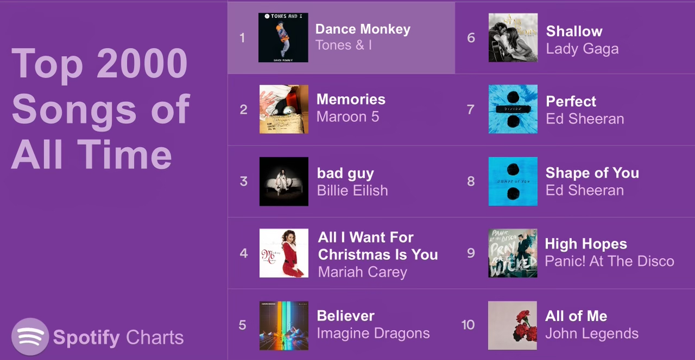

--- 
title: "Hit Song Prediction Algorithm"
author: 
- Alec Nguyen^[https://alecng27.github.io/Project_Portfolio/], Emily Sugiyama, and Hung Nguyen
date: "`r format(Sys.time(), '%B, %Y')`"
site: bookdown::bookdown_site
---

```{r setup, message=FALSE, warning=FALSE, class.source = 'fold-hide'}
knitr::opts_chunk$set(echo = TRUE, message=FALSE, warning=FALSE)
library(tidyverse)
library(caret)
library(recipes)
library(earth)
library(ipred)
library(e1071)
library(ranger)
library(rpart)
library(rpart.plot)
library(skimr)
library(corrplot)
library(caret)
library(stringr)
library(stopwords)
library(snakecase)
library(gridExtra)
library(dplyr)
library(kableExtra)

```

# Introduction


\
\
  Music has been a long-standing form of entertainment throughout humanity's history and there are songs that are better embraced by the general population more than others. This project sought out to understand the underlying factors that could explain preferences from a scientific standpoint. Various machine learning algorithms were utilized on different audio features as an attempt to predict how likely a song would make it to top chart.

Being able to identify the elements that contribute to making a song popular could be beneficial to the music industry. The implications of this project to the music industry could be crucial moving forward. 

The dataset used for this project is sourced from [Kaggle](https://www.kaggle.com/datasets/iamsumat/spotify-top-2000s-mega-dataset). The dataset contains audio statistics of the top 2000 (includes songs released from 1956 - 2019) tracks on Spotify. Songs released from 1956 to 2019 are included from some notable and famous artists like Queen, The Beatles, Guns N' Roses, etc.


